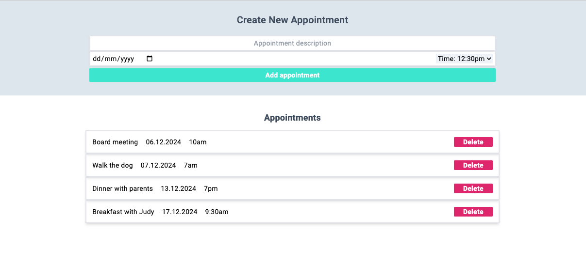
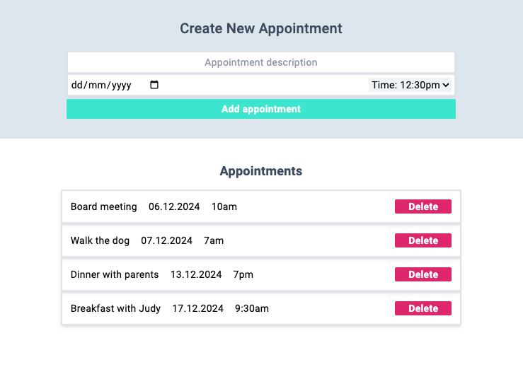
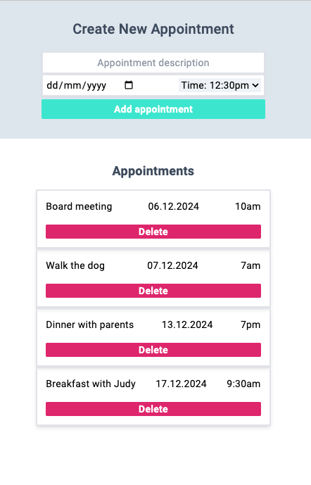

# ApointmentApp

An appointment app which adds an appointment description and a date, and uses local storage to store data. The entries are displayed with the option to delete entries. The app uses responsive design and is styled with Tailwind CSS.





This project was built with [Angular CLI](https://github.com/angular/angular-cli) version 17.3.11.

# Student Database Management Application

Full-stack web application for managing student records, built with Angular on the frontend and Django on the backend. The project focuses on CRUD operations, API integration, and automated testing across the stack.

## Overview
This application allows users to create, view, update, and delete student records through a clean Angular interface backed by a Django REST API. It was built to practice full-stack development with Angular and Python, with particular emphasis on component testing, API communication, and database integration.

## Tech Stack

**Frontend**
- Angular
- TypeScript
- HTML, CSS
- Cypress (component testing)

**Backend**
- Django
- Django REST Framework
- Python
- MySQL

**Tooling**
- Git
- Postman

## Key Features
- Student record creation, editing, and deletion
- RESTful API for student data management
- Angular forms with two-way data binding
- Client–server data validation
- Persistent storage using a relational database

## Architecture & Design
- Angular frontend communicates with backend via REST APIs
- Django REST Framework used to expose structured API endpoints
- Relational database schema for student records
- Separation of concerns between frontend UI and backend logic

## Testing
- Cypress component tests for Angular components
- Backend API testing using Django test framework
- Manual API validation with Postman

## Getting Started

```bash
git clone https://github.com/vtoch23/Angular-Python-Django-Student-Database-App.git
cd Angular-Python-Django-Student-Database-App


## Development server

Run `ng serve` for a dev server. Navigate to `http://localhost:4200/`. The application will automatically reload if you change any of the source files.

## Code scaffolding

Run `ng generate component component-name` to generate a new component. You can also use `ng generate directive|pipe|service|class|guard|interface|enum|module`.

## Build

Run `ng build` to build the project. The build artifacts will be stored in the `dist/` directory.

## Running unit tests

Run `ng test` to execute the unit tests via [Karma](https://karma-runner.github.io).

## Running end-to-end tests

Run `ng e2e` to execute the end-to-end tests via a platform of your choice. To use this command, you need to first add a package that implements end-to-end testing capabilities.

## Further help

To get more help on the Angular CLI use `ng help` or go check out the [Angular CLI Overview and Command Reference](https://angular.io/cli) page.
